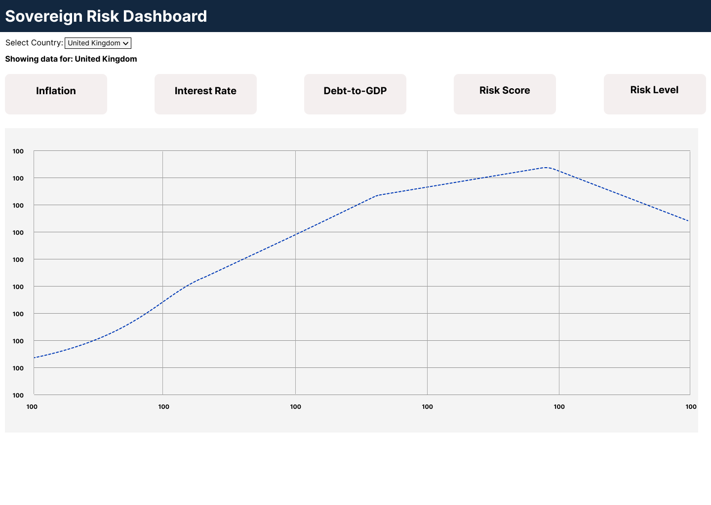
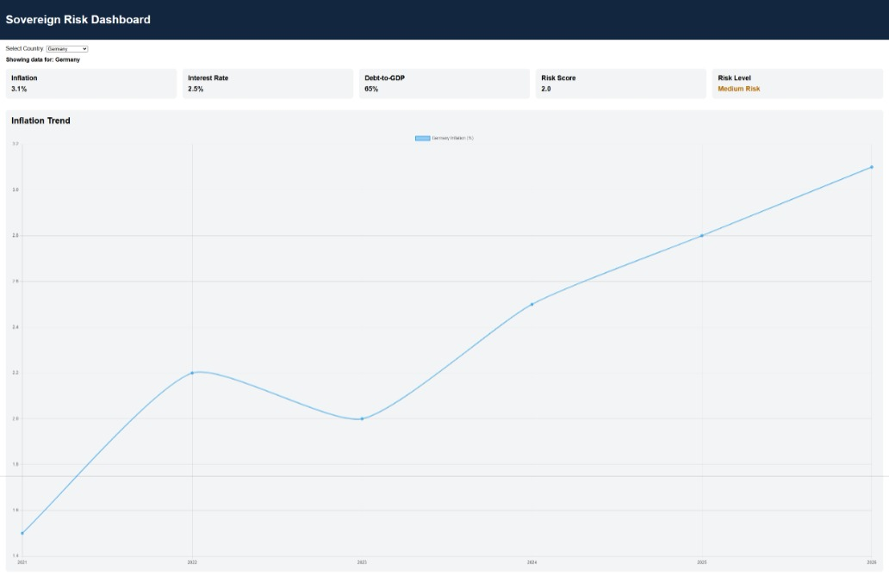
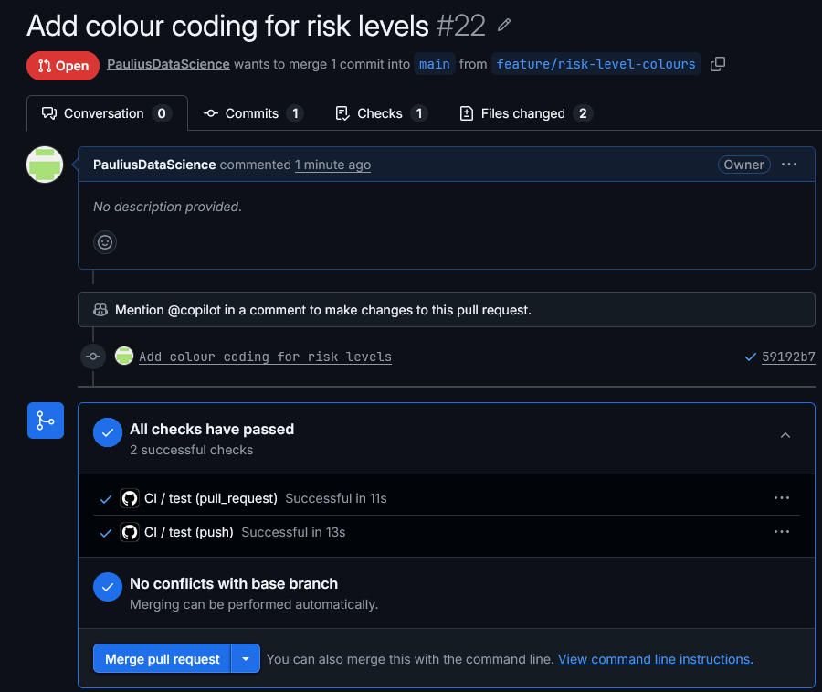

# Sovereign Risk Dashboard

## Product Overview

The Sovereign Risk Dashboard is a simple web application designed to visualise key macroeconomic indicators and provide a basic sovereign credit risk assessment.

Users can select a country and view:

- Inflation
- Interest rates
- Debt-to-GDP ratio
- A calculated sovereign risk score
- A risk classification (Low, Medium, High)
- A simple inflation trend chart

This application shows how raw macroeconomic data can be transformed into a structured and interpretable risk score. While it is a simplified and minimum viable prototype (MVP), it reflects the type of analytical tools used in financial institutions to assess sovereign risk.

## Employer Context

This product is designed for institutions such as central banks, regulators, and financial services institutions that have credit risk teams. Such teams analyse macroeconomic conditions to assess the financial stability of countries and identify potential risks from either a financial stability or from a lending perspective. This dashboard provides a simplified representation of such tools by:

- Aggregating key economic indicators
- Providing a structured risk scoring framework
- Allowing quick comparison between countries

Although the model is simplified, it demonstrates the principles behind sovereign risk assessment and decision-support tools used in financial institutions

## Problem Statement

Credit risk teams rely on a wide range of macroeconomic indicators to assess sovereign risk. However, raw data can be difficult to interpret quickly, especially when comparing multiple countries.

This project aims to address this by:

- Presenting key indicators in a single dashboard
- Converting raw data into a simplified risk score
- Providing a clear classification of risk levels
- Improving accessibility through visualisation

The goal is not to build a fully accurate financial model, but to demonstrate how data can be structured and presented to support decision-making.

## MVP Scope

The Minimum Viable Product (MVP) includes:

- A static dashboard layout built with HTML and CSS
- A country selector for switching between datasets
- Display of key macroeconomic indicators:
  -  Inflation
  -  Interest rate
  -  Debt-to-GDP
- A rule-based sovereign risk score
- Risk classification (Low, Medium, High)
- A line chart showing inflation trends using Chart.js
- Basic loading and error states
- Unit tests using Jest
- Continuous Integration using GitHub Actions

The MVP focuses on demonstrating core functionality rather than full real-world accuracy.

## Design Prototype
The wireframe was created in Figma to outline the layout of the dashboard, including the header, controls, KPI cards, and chart area. This helped guide the development process and ensured a clear structure before implementation. 



## Project Management Approach

The project followed an Agile-inspired development approach using GitHub Projects for task management.

Work was broken down into small, manageable features and tracked using issues. Each issue represented a specific task or feature, such as implementing the country selector, risk scoring logic, or chart functionality.

A Kanban-style board (GitHub projects) was used with columns such as:

- Backlog
- In progress
- Done

Tasks were moved across the board as development progressed, providing visibility into the workflow. 

This approach allowed for:

- Incremental development
- Clear tracking of progress
- Flexibility to refine requirements during development

This approach reflects key Agile principles, including iterative development, continuous feedback, and incremental delivery of features. Each feature was developed, tested, and integrated before moving on to the next, ensuring a stable and maintainable codebase.

## Ticketing and Branch Strategy

Each feature I developed was created using a structured workflow: 

1. I created a GitHub issue to describe the feature
2. I created a dedicated branch (e.g. feature/risk-score)
3. Changes were committed and pushed to the branch
4. I opened a Pull Request
5. I then merged the Pull Request into main after review

In most cases, Pull Requests included 'Closes #issue-number' to automatically close issues and maintain traceability between tasks and code changes. 

This workflow ensured:

- Clear mapping between requirements and implementation
- Clean version control history
- Incremental and testable feature development

## Development

My development process followed an incremental approach, I started with a basic static layout and gradually added functionality.

I initially made a simple HTML structure to define the layout of the dashboard, including the header, controls, and the KPI sections. I then added basic CSS styling to ensure there was a clean and readable interface. 

I then introduced some interactivity by implementing a country selector using JavaScript. I did this to allow users to switch between predefined datasets and dynamically update the displayed information. 

Following this, I developed a sovereign risk scoring function. This function uses rule-based thresholds to convert macroeconomic indicators into risk scores, which are then combined into a weighted overall score. I extended the risk score further by introducing a classification system, categorising results into Low, Medium, or High Risk to improve interpretability for users. 

I wrote unit tests using Jest to validate the risk scoring and classification logic. This helped ensure correctness and supported a Test Driven Development (TDD) approach. 

I added a line chart using Chart.js to visualise inflation trends over time. This helped enhance the dashboard by introducing a visual data component.

I made additional improvements by including loading and error states and colour-coded risk levels to improve usability.



The development process was intentionally incremental, with each feature building on the previous one. This reduced complexity, made debugging easier, and ensured that functionality was continuously working throughout development. It also aligned with the project’s use of version control and issue tracking, where i developed each feature in isolation and then merged into the main branch.

## Testing and TDD

I implemented testing using Jest to validate core logic functions.

Key components tested include:

- Risk score calculation
- Risk classification thresholds

Tests were written to:

- Validate expected outputs for given inputs
- Ensure boundary conditions are handled correctly

A Test Driven Development (TDD) approach was partially followed, where tests were written before or alongside implementation.

This helped ensure:

- Correctness of business logic
- Confidence when making change
- Improved code reliability

## CI/CD

I implemented Continuous Integration using GitHub Actions. 

I configured the workflow to:

- Install dependencies
- Run Jest tests automatically

This workflow is triggered on:

- Push to the repository
- Pull requests to the main branch



This ensures that all changes are automatically tested, helping to prevent regressions and maintain code quality.This automated testing process ensures that all changes are validated before being merged, supporting a reliable and maintainable development workflow.

## User Documentation

The Sovereign Risk Dashboard is a simple web application that allows users to explore macroeconomic indicators and view a calculated sovereign risk score.

### Running the Application
**Prerequisite**: Node.js and npm must be installed.

1. Download or clone the project repository
2. Open a terminal in the project folder
3. Install dependencies:
   ```bash
   npm install
   ```
4. Start the application:
   ```bash
   npm start
   ```
5. Open a web browser and navigate to: http://localhost:8080


### Using the Dashboard 

1. Select a country from the dropdown menu.
2. The dashboard will automatically update to display:
  - Inflation rate
  - Interest rate
  - Debt-to-GDP ratio
  - Calculated risk score
  - Risk classification
3. View the inflation trend chart to see how inflation has changed over time for the selected country.
4. Interpret the colour-coded risk level:
  - Green = Low Risk
  - Orange = Medium Risk
  - Red = High Risk

**Notes**
- The dashboard currently uses sample data for demonstration purposes.
- The risk model is simplified and is not intended to represent a production financial risk model.
- The application runs locally in the browser.

## Technical Documentation
**Prerequisite**: Node.js and npm must be installed.

### Project Setup

```bash
git clone https://github.com/PauliusDataScience/sovereign-risk-dashboard.git
cd sovereign-risk-dashboard
npm install
```
### Running the Application Locally

Start the local development server:

```bash
npm start
```
This uses http-server to serve the project locally.

The application can then be opened in a browser at:

```bash
http://localhost:8080
```
### Running Tests

Run the Jest test:

```bash
npm test
```
### Project Structure

```text
sovereign-risk-dashboard/
├── .github/
│   └── workflows/
├── docs/
│   └── screenshots/
├── src/
│   ├── data/
│   ├── js/
│   │   ├── api/
│   │   ├── charts/
│   │   ├── risk/
│   │   └── ui/
│   └── styles/
├── tests/
├── index.html
├── package.json
└── README.md
```
### Technologies Used

- HTML
- CSS
- JavaScript
- Chart.js
- Jest
- GitHub Actions
- GitHub Projects

## Evaluation

The Sovereign Risk Dashboard successfully demonstrates how macroeconomic data can be structured into a simple analytical tool.

### Strengths
- Clear and intuitive user interface
- Structured risk scoring model
- Use of testing and CI/CD
- Incremental and well-documented development process

### Limitations
- Uses static sample data rather than real-world data sources
- Simplified risk model that does not reflect full financial complexity
- Limited interactivity in data visualisation

### Future Improvements

- Integration with real-world APIs (e.g. World Bank data)
- More advanced visualisations
- Additional economic indicators
- Improved risk modelling techniques

Overall, the project successfully meets the objectives of the assignment by combining software engineering practices with data-oriented thinking. It demonstrates how a simple analytical tool can be designed, developed, tested, and evaluated using modern development workflows.
